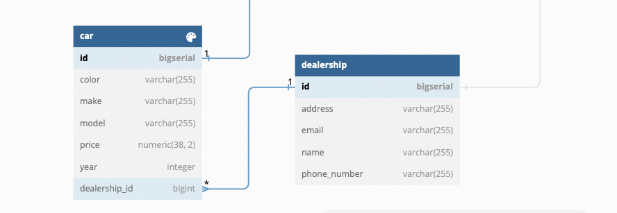

For our Dealership platform, we will define the following business requirements:
- one car per sale
- one invoice per sale
- salesperson (sales_person) can make multiple sale deals
- sales_person can work with only one dealership

With this in mind, design and implement the DB model structure

# Code from Lecture
[click here](https://github.com/dndanoff/java-db-connectivity)

# Task 1
Create a DB model which will allow you to have Dealerships with associated cars.

<details>
  <summary>Click to expand!</summary>
  
  
</details>

<details>
  <summary>Click to expand!<summary>

  ```
  public class Dealership {
    private Long id;

    private ??<Car> cars;

    private ??<SalesPerson> salesPeople;

    private String name;

    private String address;

    private String phoneNumber;

    private String email;
  }
  ```

  ```
  public class Car {
    private Long id;

    private Dealership dealership;

    private String brand;

    private String model;

    private int year;

    private String color;

    private BigDecimal price;
}
  ```
</details>

# Task 2
A salesperson is a human being associated with a dealership. One person can be employed at only one dealership

<details>
  <summary>Click to expand!</summary>
  
  
</details>

<details>
  <summary>Click to expand!</summary>
  
  ```
  public class SalesPerson {
    private Long id;

    private Dealership dealership;

    private ??<Sale> sales;

    private String name;

    private String email;

    private String phoneNumber;
}
  ```
</details>

# Task 3
To execute a Car sale define a "sale" table which whill be connected to sales_person (the executor of the deal). One sale is associated to one invoice and to only one car

<details>
  <summary>Click to expand!</summary>
  
  
</details>

<details>
  <summary>Click to expand!</summary>
  
  ```
  public class Invoice {

    private Long id;

    private String invoiceNumber;

    private String customerName;

    private LocalDate invoiceDate;

    private BigDecimal basePrice;

    private BigDecimal taxRate;

    private BigDecimal totalPrice;

}

  ```
</details>

# Task 4
For a sale to have everything we need to define the invoice which will be given to the customer. One invoice can be assosicated to one sale.

<details>
  <summary>Click to expand!</summary>
  
  
</details>

Final DB Diagram:
<details>
  <summary>Click to expand!</summary>
  
  
</details>

# Task 4
In our dealership platform we want to be able to create new dealership via REST API

example endpoint body:
```
{
    "name": "Best Dealership",
    "address": "123 James Baucher St",
    "phoneNumber": "+359 999999999",
    "email": "info@bestdealership.com"
}
```

# Task 5

Business value:
Dealership without cars cannot function properly. I want to be able to add a car to my dealership so I can sell it in later stage

Acceptance criteria:

Given I'm a dealership
When I acquire a new car
Then the car is saved inside DB
And the car is associated to my dealership


example endpoint body
```
{
    "dealershipId": 1,
    "brand": "Honda",
    "model": "Civic",
    "year": 2021,
    "color": "Red",
    "price": 25000.00
}

```

# Task 6
In order to sell cars the dealership needs sales people. I want to be able to hire new employees that will sell cars.

Given I'm a dealership
When I hire a new seller
Then the seller is saved inside DB
And the seller is associated to my dealership


## DB diagram code
<details>
  <summary>dbdiagram.io</summary>
  
  ```
  // Use DBML to define your database structure
  // Docs: https://dbml.dbdiagram.io/docs

  Table "invoice" {
    "id" bigserial [pk, not null, increment]
    "base_price" bigdecimal
    "customer_name" varchar(255)
    "invoice_date" date
    "invoice_number" varchar(255)
    "tax_rate" "numeric(38, 2)"
    "total_price" "numeric(38, 2)"
  }


  Table "car" {
    "id" bigserial [pk, not null, increment]
    "color" varchar(255)
    "make" varchar(255)
    "model" varchar(255)
    "price" "numeric(38, 2)"
    "year" integer
    "dealership_id" bigint
  }
  Ref: "car"."dealership_id" > "dealership"."id"

  Table "dealership" {
    "id" bigserial [pk, not null, increment]
    "address" varchar(255)
    "email" varchar(255)
    "name" varchar(255)
    "phone_number" varchar(255)
  }

  Table "sale" {
    "id" bigserial [pk, not null, increment]
    "sale_date" date
    "total_price" "numeric(38, 2)"
    "car_id" bigint
    "invoice_id" bigint
    "sales_person_id" bigint
  }
  Ref: "car"."id" - "sale"."car_id"
  Ref: "invoice"."id" - "sale"."invoice_id"

  Table "sales_person" {
    "id" bigserial [pk, not null, increment]
    "email" varchar(255)
    "name" varchar(255)
    "phone_number" varchar(255)
    "dealership_id" bigint
  }
  Ref: "sales_person"."dealership_id" > "dealership"."id"
  Ref: "sales_person"."id" < "sale"."sales_person_id"
  ```
</details>